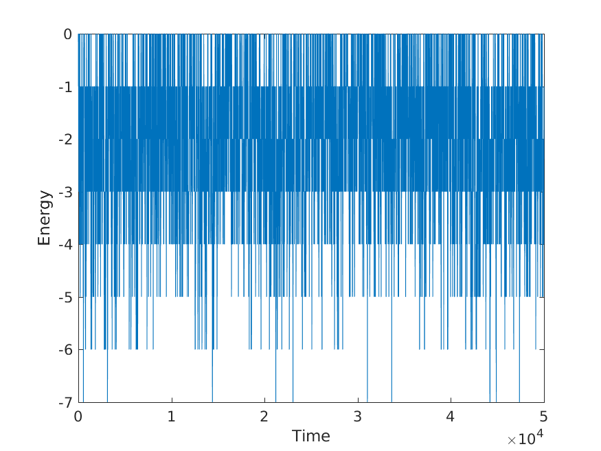
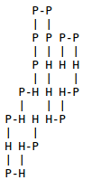

# The Hydrophobic Polar Model for proteins

This repo contains an implementation in Python of the HP model for proteins. 

## Introduction 

Proteins have a key role in almost all the biological process, they are used for structural, communication, energy storage, catalysis and many other purposes inside
the cells. To carry out its intended biological functions a protein needs to reach its folded shape. Some models have been developed in order to understand how proteins
reach their folded shape. In this work an approach to understand this behavior was done by using the hydrophobic polar model together with the Metropolis and
simulated annealing algorithms.

## Background 

Proteins are formed by long chains of length between 50 to 20 thousand monomers called amino acids, there are 20 different of them that can be combined on this
chains, the sequence of this monomers gives the protein an unique structure and function. An important property of proteins is that they manage to find the proper
structure within a universe of possibilities in just some seconds, it has been found that if a protein is put back into its biological natural environment it folds into its
natural configuration.

In physics the problem of the structure and shape of the proteins has been approached from a statistical physics and energetic point of view with some help of optimization computational methods.
In some of this approaches the folding process is considered to happen randomly with certain probability which depends on the energy configuration of that struc-
ture, the energy of each state is considered to be the one of the joins of the chain, the amino acid bonds.

The Hydrophobic Polar (HP) model is a simplified model for studying proteins folding. In this model amino acids which conform the protein structure are con-
sidered of only two types, hydrophobic (H) or polar (P) and the protein folding is given by a self avoiding walk, i.e. a sequence of movements in a lattice where
a point is not visited more than once. The folded state of a protein can be seen as an minimum energy state, this can be understood if we consider that certain
amino acid chains are able to participate in the hydrogen bonding network of their environment and the binding with particles of the its surrounding its determine by
the way it is folded.

Simulations can be held by considering a two dimensional lattice where a protein is considered to exists in a sequence of points x1, x2, ..., xn . The energy is calculated by
counting the number of HH contacts

Considering E i the different energies of a particular sequence, g i the different number of folded states with that energy, also known as degeneracy, then by using
Boltzmann statistics, the probability in thermal equilibrium for a particular state with energy E i us given by

with Z the partition function defined as

### Metropolis Algorithm

Monte Carlo method turns to be a god tool when it comes to thermodynamical systems where the total number of possibilities is a non-trivial large astronomical
number. It allows us to get an estimate from a small but representative fraction of the total population. By using this method it is possible to construct a trajectory
in the configuration space that allow us to visit the states according to Boltzmann distribution.

In order to have a better performance a criterion for accepting and rejecting moves to new configurations can be implemented. The Metropolis algorithm considers 
there is a probability of accepting a move when this causes an energy decrease, when the energy change is positive the move is accepted with an exponential prob-
ability.

With w_vv 0 the probability per unit time that if it is in a state v, it will make a transition to state v 0 and β = 1/k B T , kB is the Boltzmann constant and T is the
temperature, in this case a parameter to control the probability of a acceptance.

### Simulated Annealing

Simulated annealing is a method to find an acceptable solution to an optimization problem. It is particular good for problems where it is needed to find a maximum or
a minimum. The idea of the algorithm is to mimic the process from where it takes its name, this is the process that happens in the misplaced atoms of a metal that
is heated and then slowly cooled. It makes use of the Metropolis algorithm but it provides a way to control the probability of acceptance of unfavorable energetically
steps, this means adjusting the temperature T. From equation 2.4 it is possible to realize that as T is large the probability of accepting changes where the energy does
not decreases is big but as it decreases the changes to higher energy states should be less probable. An important part of the simulated annealing algorithm is to choose
a good way to low the temperature, this is known as annealing schedules.

## Simulations 

The sequences analyzed had a length of 25 monomers, regardless the sequence of amino acids there are 5768299665 possibilities of self avoiding walks of that length, and depending on the sequence each could have one or several energetic ground states. 

Different cooling schedules were sed in one of the sequence to check how the performance of this algorithm changed with this variations. The simulations done were composed by two main parts. The folding of the proteins and the Metropolis algorithm within the simulated annealing. The code of the folding `pivot.py` was provided in the course website and it consisted of the following steps:

1. Randomly select a pivot point *k*
2. Select a random rotation or reflection.
3. Apply the rotation on the *x_k* element and the subsequent sites *x_k+1* . . . *x_N*
4. Check if the new state is self avoiding and keep it if it is.

The program takes as arguments an initial protein sequence and its structure or in the case that it is nor provided a linear structure is supposed, then it can calls the method pivot which is the responsible of the folding following the steps described above.

The program is called from a main program `proteins.py` where the sequence and structures (if needed) are defined, once a new chain was made we proceed to calculate its energy in order to apply the steps concerning to the Metropolis and simulated annealing algorithms the steps done were: Defining v(t) = v as the state of the system at a certain time then we have the next selection rules:

* v(t + 1) = v' when ∆E_vv' ≤ 0

and when ∆E_vv'  > 0

with x a random number between 0 and 1. This process was repeated 50 times for every thermal cooling, the energy of the protein was recorded at every thermal step and the results are saved in a text file for its later analysis. For every repetition of this cycles the minimum structure found was record and its energy too in another file.

## Results

5 different sequences of length 25 were analyzed, it was intended to find the structure on which each have their ground state. The sequences analyzed within its ground energy and degeneracy are shown in the table bellow.

| Sequence      | E_ground      | Degeneracy  |
| ------------- |:-------------:| -----:|
| HHPHHPHPPHHPHPPHPPPHHPHPH      | -10 | 1  |
| PHHHHPHHHPPPPPHHHPHHHPHHH      | -11 | 1  |
| PHHHPPPHPPHHPHHPPPPPHPPHH      | -9  | 1  |
| HPPHPHPHHHPPPPPHPHPHPHHPH      | -10 | 14 |
| HPPPHPHPHPPHPPPHHHPPPHHPP      | -7  | 10 |

Setting the simulation at a constant temperature the histograms of the sequences were obtained, to determine how was the energy probability distribution of them simulations with 70000 thermal steps and for each this process was repeated 50 times.

Energy as a function of time without simulated annealing

Energy distribution for the first sequence. 

### Analysis of different cooling schedules

A point of interest was to look how the search for the ground energy state could be improved by applying this method and how it changed when different cooling schedules were used

* T = T 0 /log(t + e)
* T = T 0 − t(T 0 − 0.1)/t_max
* T = T 0 (t − t_max + 1) 2 /t_max

and a combination of the first and the second one in the form of

where *T_0* is the initial temperature, t is the time and *t_max* is the maximum simulation time. For each of the different cooling schedules the algorithm was run 20 times in simulations of 70000 thermal steps to see how many of this times it was possible to find the global minimum.

Using the cooling schedule that showed a better performance, the ground state of the structures was searched. Some of the ground states found are shown in the figures bellow.

Sequence: HHPHHPHPPHHPHPPHPPPHHPHPH

Sequence: PHHHHPHHHPPPPPHHHPHHHPHHH

Sequence: PHHHPPPHPPHHPHHPPPPPHPPHH

Squence: HPPHPHPHHHPPPPPHPHPHPHHPH

Squence: HPPPHPHPHPPHPPPHHHPPPHHPP

